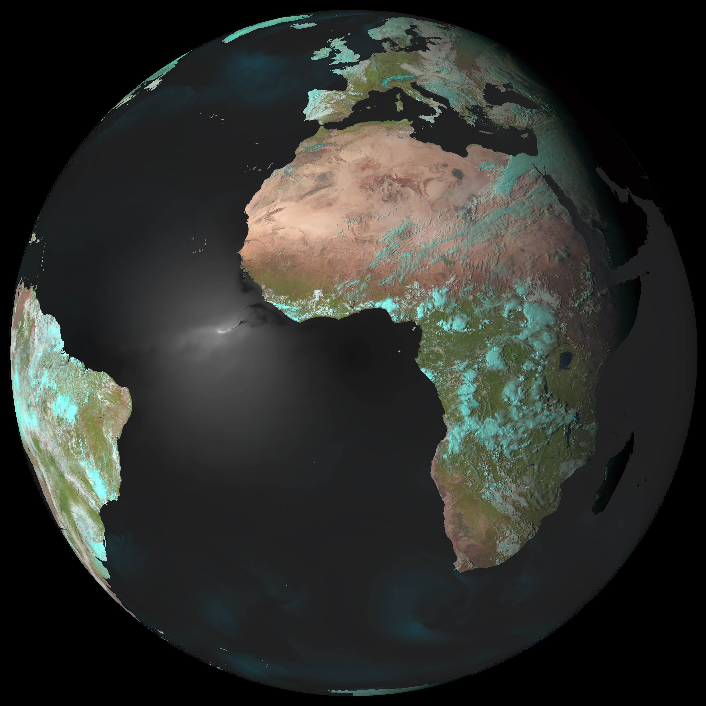

..  documentation master file, created by
   sphinx-quickstart on Tue Jan  4 21:30:24 2022.
   You can adapt this file completely to your liking, but it should at least
   contain the root `toctree` directive.

Welcome to pycoxmunk's documentation!
==================================
pycoxmunk: A library for estimating sea surface reflectances
__________________________________________________________

`pycoxmunk` is a python library that estimates sea surface reflectance using the
`Cox-Munk method <https://doi.org/10.5194/amt-3-813-2010>`_. It is designed for use in areas of open water and may
not provide accurate results in coastal regions, for rivers or for lakes. `pycoxmunk` is designed to be flexible,
supporting a wide range of satellite sensors and allowing the inclusion of surface wind speeds to simulate the effects
of white caps and other wind related wave effects

A spectral database of water properties is included, allowing
`pycoxmunk` to operate across the visible and near-infrared spectrum from approx. 450 to 3700nm. For wavelengths in the
shortwave infrared, however, care must be taken as some of the actual signal measured by a satellite will be from the
thermal infrared emission of the water surface. `pycoxmunk` only handles solar reflectance.

This library is designed to work in tandem with the `satpy library <https://github.com/pytroll/satpy>`_ that reads data
from a wide variety of satellite sensors. However, users who do not with to use `satpy` can also generate input data
for `pycoxmunk` themselves. `pycoxmunk` also uses the `dask library <https://github.com/dask/dask>`_ to enable efficient
computation while minimising memory overhead for users operating on smaller machines such as laptops. Dask cna require
some tuning for optimal use, so please read the quickstart section on this if you encounter memory or processing time
problems.

The `pycoxmunk` code is open-source and `available on GitHub <https://github.com/simonrp84/PyCoxMunk>`_. Pull requests
to add new features, improve accuracy, fix bugs, etc are more than welcome. You can also ask questions and raise bug
reports via the issues tab on the GitHub page.

New users should refer to the `quickstart <_PCM_Quickstart>`_ documentation, while more advanced users can refer to the
`API documentation <_PCM_API>`_ and the `technical description <_PCM_Technical>`_ of the correction method used in SMACPy.

   An example of the pycoxmunk-derived sea surface reflectance overlaid upon a Meteosat Second Generation `natural color` image of the Earth.

   This is the caption.

.. toctree::
   :maxdepth: 2
   :caption: Contents:

   Quickstart
   API_Documentation
   PCM_Technical

Indices and tables
==================

* :ref:`genindex`
* :ref:`modindex`
* :ref:`search`